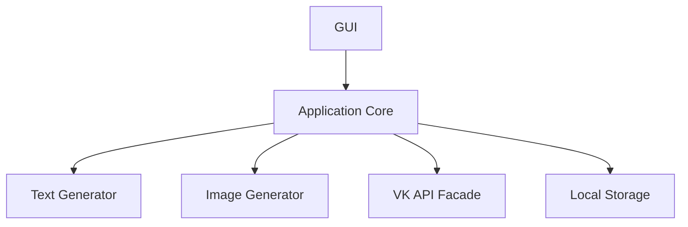

# 🚀 SMM AI Assistant | Генератор постов для VK

<div align="center">
  
  
  <div>
    <a href="#установка">
      
    </a>
    <a href="https://github.com/yourusername/smm-ai-assistant/releases">
      
    </a>
    <a href="#лицензия">
      
    </a>
  </div>

  <div>
    
    
    
  </div>
  
  <p><em>Автоматизация SMM с искусственным интеллектом — создание контента стало проще!</em></p>
</div>


2. **Создайте виртуальное окружение**:
   ```bash
   python -m venv venv
   source venv/bin/activate  # Linux/Mac
   venv\Scripts\activate     # Windows
   ```

3. **Установите зависимости**:
   ```bash
   pip install -r requirements.txt
   ```

4. **Настройте конфигурацию**:
   ```ini
   # data/config.ini
   [VK]
   access_token = ваш_токен
   group_id = ваш_id_группы
   ```

## 🖥️ Запуск

```bash
python main.py
```

## 🛠 Технологии

<div align="center">

| Компонент       | Технологии                          |
|-----------------|-------------------------------------|
| 📝 NLP          | Hugging Face Transformers, LangChain|
| 🎨 Генерация изображений | Stable Diffusion (Diffusers)       |
| 🌐 VK API       | vk-api (официальная библиотека)     |
| 🖥️ GUI         | PyQt5                               |
| 🗃️ Локальное хранилище | SQLite (SQLAlchemy ORM)          |

</div>

## 📸 Скриншоты

<div align="center">
  
  
  
</div>

## 🏗️ Архитектура



## 🤝 Как помочь проекту

1. **Сообщайте об ошибках** через Issues
2. **Предлагайте улучшения** через Pull Requests
3. **Распространяйте** среди SMM-специалистов

## 📜 Лицензия

MIT License. Подробнее в файле [LICENSE](LICENSE).

---

<div align="center">
  <sub>Создано с ❤️ для сообщества VK</sub>
</div>
